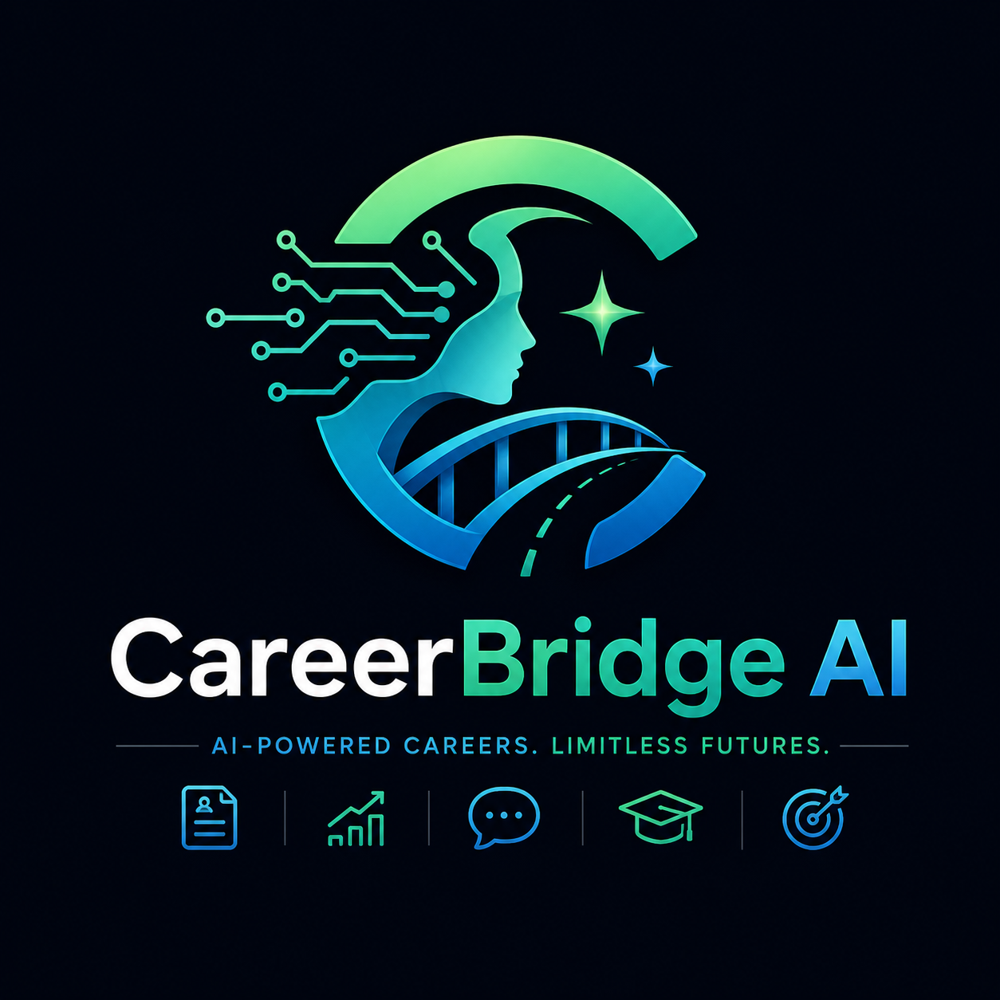
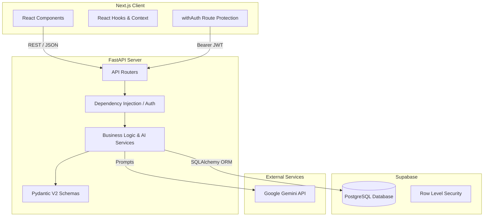

<div align="center">
  
  <h1>CareerBridge AI</h1>
  <p><strong>AI-Powered Career Intelligence & Placement Preparation Platform</strong></p>
  <p>An intelligent, full-stack ecosystem designed to empower students and professionals to navigate their career journey, optimize resumes, bridge skill gaps, and excel in interviews.</p>

  <!-- Badges -->
  <p>
    
    
    
    
    
    
  </p>
  <p>
    
    
    
    
    
    
    
    
  </p>
</div>

---

## 📋 Table of Contents

- [Project Overview](#project-overview)
- [Features](#features)
- [Screenshots](#screenshots)
- [System Architecture](#system-architecture)
- [Tech Stack](#tech-stack)
- [Project Structure](#project-structure)
- [Modules](#modules)
- [Database Structure](#database-structure)
- [API Documentation](#api-documentation)
- [Installation & Local Development](#installation--local-development)
- [Environment Variables](#environment-variables)
- [Deployment Configuration](#deployment-configuration)
- [Security](#security)
- [AI Features](#ai-features)
- [Responsive Design & Performance](#responsive-design--performance)
- [Future Enhancements](#future-enhancements)
- [Contributing](#contributing)
- [License](#license)
- [Developer](#developer)

---

## 🌟 Project Overview

### What is CareerBridge AI?
CareerBridge AI is a state-of-the-art, AI-powered career intelligence and placement preparation web application. Built with a scalable micro-architecture consisting of a Next.js frontend and a FastAPI backend connected to a Supabase PostgreSQL database, the platform operates as a personalized career mentor.

### Why was it developed?
The modern job market is fiercely competitive. Students and early-career professionals often lack targeted guidance on resume building, skill gap analysis, and interview preparation. Generic advice fails to meet the specific requirements of highly specialized technical and business roles.

### Problem Statement
Candidates struggle to translate their educational background into industry-ready profiles. They face challenges getting their resumes past Applicant Tracking Systems (ATS), identifying what skills they need to learn for their target roles, and preparing for the nuanced questions asked in real technical interviews.

### Solution
CareerBridge AI bridges the gap between academic learning and industry expectations by providing data-driven resume analysis, real-time mock interviews, personalized learning roadmaps, and actionable career intelligence generated by advanced AI services.

### Objectives
- Maximize the placement success rate of students and professionals.
- Provide real-time, constructive feedback on resumes and interviews.
- Deliver personalized, actionable intelligence for career planning.

### Target Users
- **University Students** preparing for their first placements.
- **Early-Career Professionals** seeking lateral movement or promotions.
- **Career Changers** needing targeted skill gap analysis.

### Benefits
- **Higher ATS Pass Rates:** Automated resume scoring against industry keywords.
- **Enhanced Confidence:** Real-time AI mock interviews simulate real-world pressure.
- **Targeted Upskilling:** AI pinpoints exactly what skills are missing for a target job.

---

## ✨ Features

### Authentication & Authorization
- **Register:** Secure student account creation with strict password policies.
- **Login:** JWT-based stateless authentication with `HTTPBearer`.
- **Remember Me:** Secure token persistence via Local Storage and Session Storage.
- **Forgot Password / Reset Password:** Secure workflows to reclaim account access.
- **Role-Based Authentication (RBAC):** Strict segregation between `Student` and `Admin` roles.
- **Protected Routes:** Frontend Higher-Order Components (HOC) and Backend Dependency Injection (`get_current_user`) block unauthenticated access.

### Dashboard & Analytics
- **Dashboard:** Unified command center displaying Placement Readiness Score, Total Interviews, and Skill Mastery.
- **Admin Dashboard:** Centralized metrics for institutional overview and user management.

### Resume Intelligence
- **Resume Analyzer:** Deep ATS compatibility checks, keyword analysis, and actionable feedback.
- **Resume Builder:** Dynamic, auto-saving component to craft professional resumes.
- **Resume Validation:** Strict backend rules enforcing resume quality.
- **Resume Templates:** (Planned) Multiple industry-standard export templates.
- **PDF Export:** (Planned) Single-click resume downloads.
- **Resume Sharing:** (Planned) Public URLs for recruiter visibility.

### Career & Skill Intelligence
- **Skill Gap Analysis:** AI-driven comparison between current skills and target role requirements.
- **Career Intelligence:** Industry insights, remote work trends, and emerging technology analytics.
- **AI Career Coach:** A specialized, conversational AI assistant providing hyper-personalized career advice.
- **Career Target:** Granular settings to define target roles, industries, and expected salaries.

### Placement & Interview Preparation
- **Mock Interview:** AI-generated behavioral and technical questions based on the user's resume and target role.
- **Placement Readiness:** Aggregated algorithmic scoring defining the probability of landing a role.
- **Learning Resources:** Curated articles, courses, and documentation links.
- **Learning Roadmap:** Chronological, step-by-step upskilling timeline.

### User Management
- **Profile:** Manage personal information, academic details, and external links (GitHub/LinkedIn).
- **Settings:** Advanced configuration for career targets, email preferences, and password security.
- **Notifications:** In-app alert system for upcoming interviews, resume milestones, and system updates.

### System-Wide Features
- **Responsive Design:** Flawless rendering across Desktop, Tablet, and Mobile devices.
- **Dark Mode:** Deep, premium dark aesthetics built with Tailwind CSS.
- **AI Integration:** Real-time generative endpoints powering all analytical features.

---

## 📸 Screenshots

<div align="center">
  <h3>Desktop Screens</h3>
  
  
  
  
  
  <h3>Mobile Screens</h3>
  
  
</div>

> *Note: Replace placeholders with actual application screenshots.*

---

## 🏗️ System Architecture



---

## 💻 Tech Stack

| Layer | Technologies |
| :--- | :--- |
| **Frontend** | Next.js 15, React 19, Tailwind CSS 3.4, Framer Motion, Lucide React, Recharts |
| **Backend** | FastAPI 0.110, Uvicorn, Python 3.x, Pydantic V2, python-multipart |
| **Database** | Supabase (PostgreSQL 15), SQLAlchemy 2.0, Psycopg2-binary |
| **Authentication**| JWT (python-jose), Passlib (bcrypt), React Context API |
| **AI** | Google Gemini API (Simulated/Integrated) |
| **Cloud Storage** | (Planned) Cloudinary / Supabase Storage for Resumes |
| **Deployment** | Vercel (Frontend), Render/Railway/AWS (Backend) |
| **Dev Tools** | Postman, Git, NPM/Pip |

---

## 📂 Project Structure

```text
CareerBridge-AI/
├── frontend/                     # Next.js Application
│   ├── src/
│   │   ├── assets/               # Images and static assets
│   │   ├── components/           # Reusable UI components (Sidebar, Topbar, PasswordSecurity)
│   │   ├── context/              # React Context (AuthContext)
│   │   ├── pages/                # Next.js Page Routes (Dashboard, Resume, Coach)
│   │   ├── services/             # Axios API Client configurations
│   │   ├── styles/               # Global CSS and Tailwind definitions
│   │   └── utils/                # Helper functions (Password Validation)
│   ├── package.json              # NPM Dependencies
│   └── tailwind.config.js        # Tailwind Design System tokens
│
└── backend/                      # FastAPI Application
    ├── app/
    │   ├── api/                  # API Endpoint Routers (auth.py, resume.py, etc.)
    │   ├── core/                 # Configs, Security, Validators (validators.py)
    │   ├── models/               # SQLAlchemy Database Models (student.py, resume.py)
    │   ├── schemas/              # Pydantic V2 Schemas for I/O validation
    │   ├── services/             # Business Logic (auth_service.py, resume_service.py)
    │   └── main.py               # FastAPI App Initialization and CORS setup
    ├── .env                      # Database and Secret Configuration
    └── requirements.txt          # Python Dependencies
```

### Folder Purposes
- **`frontend/src/pages`**: Contains all routed components. Follows strict aesthetic rules defined by global design tokens.
- **`frontend/src/components`**: Houses modular UI elements (e.g., `PasswordSecurity` for unified password strength testing).
- **`backend/app/api`**: Separates route definitions into logical domain files (`interviews.py`, `learning.py`).
- **`backend/app/schemas`**: Provides robust, type-safe request/response validation utilizing `@model_validator`.
- **`backend/app/models`**: Maps Python classes directly to Supabase PostgreSQL relational tables.

---

## 🧩 Modules

### Authentication Module
Handles the entire user lifecycle. From registration with strict, dynamic password validation, to JWT issuance and validation. Includes endpoints for secure password resets.

### Dashboard Module
Aggregates data from multiple services to present a high-level overview. Calculates the "Placement Readiness Score" dynamically based on resume strength and interview performance.

### Resume Module
A bifurcated system offering both an interactive `ResumeBuilder` for creating ATS-friendly resumes and a `ResumeAnalyzer` for scoring existing profiles against targeted industry standards.

### Skill Gap Module
Compares the user's currently documented skills against the standard requirements of their "Target Role", outputting actionable missing skills and proficiency suggestions.

### Career Coach Module
A conversational interface (`AICareerCoach`) that provides contextual guidance. It retains session context to offer highly relevant industry insights and remote work trends.

### Mock Interview Module
Generates dynamic interview questions based on the user's resume. Records user responses (text-based) and provides real-time AI feedback on tone, technical accuracy, and completeness.

### Learning Module
Supplies the `LearningResources` and `LearningRoadmap`. Recommends specific courses, documentation, and sequential milestones tailored to close identified skill gaps.

### Placement Module
Predictive analytics determining the user's likelihood of securing their target role, generating a detailed "Recommended Action" matrix.

### Notification Module
A background service delivering important system alerts (e.g., "Complete your profile", "Interview scheduled").

### Settings Module
Allows users to alter system preferences, update password credentials, and define their ultimate career target metrics (Role, Salary, Location).

### Admin Module
Protected domain strictly for institutional oversight, tracking total active students and overall system engagement metrics.

---

## 🗄️ Database Structure

CareerBridge AI utilizes a robust **PostgreSQL** database hosted on **Supabase**.

### Core Tables

1. **`students`**
   - **Primary Key:** `id` (UUID)
   - **Fields:** `full_name`, `email`, `hashed_password`, `role`, `created_at`
   - **Purpose:** Stores core user authentication and authorization data.

2. **`resumes`**
   - **Primary Key:** `id` (UUID)
   - **Foreign Key:** `student_id` (References `students.id`)
   - **Fields:** `content_json`, `ats_score`, `last_analyzed`
   - **Purpose:** Persists structured resume data for builder auto-saving and analysis tracking.

3. **`skills`**
   - **Primary Key:** `id` (UUID)
   - **Foreign Key:** `student_id` (References `students.id`)
   - **Fields:** `skill_name`, `proficiency`, `is_verified`
   - **Purpose:** Tracks individual user competencies for gap analysis.

4. **`jobs` (Target Roles)**
   - **Primary Key:** `id` (UUID)
   - **Foreign Key:** `student_id` (References `students.id`)
   - **Fields:** `title`, `industry`, `expected_salary`
   - **Purpose:** Stores the user's ultimate career goals to tailor AI outputs.

5. **`interviews` (Mock Sessions)**
   - **Primary Key:** `id` (UUID)
   - **Foreign Key:** `student_id` (References `students.id`)
   - **Fields:** `score`, `feedback_json`, `date_conducted`
   - **Purpose:** Records historical performance in simulated technical interviews.

6. **`audit_logs`**
   - **Primary Key:** `id` (UUID)
   - **Fields:** `user_id`, `action`, `status`, `ip_address`
   - **Purpose:** Security tracing for critical actions (e.g., password changes, login attempts).

---

## 🔌 API Documentation

All endpoints are prefixed with `/api`. Authenticated endpoints require a `Bearer <JWT_TOKEN>` in the Authorization header.

### Authentication (`/auth`)
| Method | Route | Purpose | Auth Required |
| :--- | :--- | :--- | :--- |
| `POST` | `/auth/register` | Create a new student account | No |
| `POST` | `/auth/login` | Authenticate and retrieve JWT | No |
| `POST` | `/auth/reset-password` | Reset user password | No |
| `POST` | `/auth/change-password` | Update password from settings | Yes |

### Profile & Settings (`/profile`, `/settings`)
| Method | Route | Purpose | Auth Required |
| :--- | :--- | :--- | :--- |
| `GET`  | `/profile` | Fetch user profile data | Yes |
| `PUT`  | `/profile` | Update profile information | Yes |
| `GET`  | `/settings` | Fetch career targets & preferences | Yes |
| `PUT`  | `/settings` | Update career targets | Yes |

### Analytics & Dashboard (`/analytics`)
| Method | Route | Purpose | Auth Required |
| :--- | :--- | :--- | :--- |
| `GET`  | `/dashboard/student` | Fetch student dashboard metrics | Yes |
| `GET`  | `/dashboard/admin` | Fetch admin overview metrics | Yes (Admin) |
| `GET`  | `/analysis/skill-gap` | Execute AI skill gap assessment | Yes |
| `GET`  | `/analysis/placement-readiness` | Generate readiness score | Yes |
| `GET`  | `/career/intelligence` | Fetch industry trends | Yes |

### Resume Operations (`/resume`)
| Method | Route | Purpose | Auth Required |
| :--- | :--- | :--- | :--- |
| `GET`  | `/resume` | Fetch the current saved resume | Yes |
| `POST` | `/resume` | Auto-save resume builder content | Yes |
| `POST` | `/resume/analyze` | Run ATS checks on resume content | Yes |

### Interviews & Learning (`/interviews`, `/learning`)
| Method | Route | Purpose | Auth Required |
| :--- | :--- | :--- | :--- |
| `GET`  | `/interviews/mock` | Generate new mock questions | Yes |
| `POST` | `/interviews/mock/message` | Submit answer for AI feedback | Yes |
| `GET`  | `/learning/roadmap` | Fetch structured learning path | Yes |
| `GET`  | `/learning/resources` | Fetch curated external resources | Yes |

### Coach & Notifications (`/coach`, `/notifications`)
| Method | Route | Purpose | Auth Required |
| :--- | :--- | :--- | :--- |
| `GET`  | `/coach/session` | Initialize AI coach session | Yes |
| `POST` | `/coach/message` | Send prompt to AI coach | Yes |
| `GET`  | `/notifications` | Fetch unread system alerts | Yes |

---

## 🛠️ Installation & Local Development

### Prerequisites
- Node.js (v18+)
- Python (v3.10+)
- PostgreSQL (or Supabase account)
- Git

### 1. Clone the Repository
```bash
git clone https://github.com/your-username/CareerBridge-AI.git
cd CareerBridge-AI
```

### 2. Database Setup (Supabase)
1. Create a new project on [Supabase](https://supabase.com/).
2. Retrieve your `Database Password` and `Connection String (URI)`.
3. (Optional) Run any pending Alembic migrations or manually map models.

### 3. Backend Setup (FastAPI)
```bash
cd backend
# Create Virtual Environment
python -m venv venv

# Activate Environment
# Windows:
venv\Scripts\activate
# Mac/Linux:
source venv/bin/activate

# Install Dependencies
pip install -r requirements.txt

# Run the Development Server
uvicorn app.main:app --reload --port 8000
```
*The backend will be available at `http://localhost:8000`. Swagger UI at `http://localhost:8000/docs`.*

### 4. Frontend Setup (Next.js)
```bash
cd frontend
# Install Dependencies
npm install

# Run the Development Server
npm run dev
```
*The frontend will be available at `http://localhost:3000`.*

---

## 🔐 Environment Variables

Ensure these files are kept out of version control (`.gitignore`).

### Backend (`backend/.env`)
| Variable | Description | Example |
| :--- | :--- | :--- |
| `DATABASE_URL` | Supabase PostgreSQL Connection String | `postgresql+psycopg2://...` |
| `SECRET_KEY` | Key for signing JWTs | `your-secure-random-string` |
| `ALGORITHM` | JWT Encoding Algorithm | `HS256` |
| `ACCESS_TOKEN_EXPIRE_MINUTES` | JWT Lifespan | `1440` |
| `GEMINI_API_KEY` | Optional: External AI Service Key | `AIzaSyB...` |

### Frontend (`frontend/.env.local`)
| Variable | Description | Example |
| :--- | :--- | :--- |
| `NEXT_PUBLIC_API_URL` | Point to FastAPI Backend | `http://localhost:8000/api` |

---

## 🚀 Deployment Configuration

### Frontend (Vercel)
The Next.js frontend is fully optimized for Vercel deployment.
1. Push your code to GitHub.
2. Import the project into Vercel.
3. Set the Root Directory to `frontend`.
4. Configure the Environment Variable `NEXT_PUBLIC_API_URL` to point to your live backend.
5. Deploy.

### Backend (Render / AWS / Railway)
The FastAPI application can be deployed using Docker or native Python environments.
1. Ensure the `uvicorn` web server is bound to the dynamic `$PORT`.
2. Supply the `DATABASE_URL` pointing to your production Supabase pool.
3. Configure CORS in `main.py` to accept requests strictly from your Vercel URL.

### Database (Supabase)
Ensure that your connection string utilizes Supabase's IPv4 connection pooler (port 6543) if deploying to environments without IPv6 support.

---

## 🛡️ Security

CareerBridge AI implements enterprise-grade security protocols:
- **Stateless Authentication:** JSON Web Tokens (JWT) eliminate session highjacking vectors. Tokens are verified via the `get_current_user` dependency before any data is served.
- **Password Cryptography:** `passlib` utilizing `bcrypt` algorithms ensures plain-text passwords never touch the database.
- **Strict Validation Pipelines:** Custom `validate_strong_password` schemas enforce length, casing, symbols, and restrict usage of personal identifiers inside passwords.
- **CORS Protection:** Cross-Origin Resource Sharing is strictly limited to whitelisted frontend domains.
- **Audit Logging:** Password changes, resets, and critical failures are logged with timestamps and originating IP addresses for intrusion detection.

---

## 🧠 AI Features

The platform's core value proposition is driven by Artificial Intelligence:
- **Resume Scoring Engine:** Parsed JSON resume data is evaluated against keyword matrices to calculate an ATS compatibility score.
- **Skill Gap Detection:** NLP algorithms assess the delta between a user's `skills` table and the standardized requirements of their `target_role`.
- **Mock Interview Generation:** Dynamic question generation preventing repetitive scenarios, tailored to the specific seniority level indicated in the user's profile.
- **Placement Prediction:** A weighted algorithm combining Resume Score, Interview Score, and Profile Completeness to generate a realistic Placement Readiness percentage.

---

## 📱 Responsive Design & Performance

- **Fluid Layouts:** Constructed using Tailwind CSS utility classes (`md:`, `lg:`), ensuring the application adapts gracefully from 4K desktop monitors down to 320px mobile screens.
- **Component Reusability:** The UI architecture relies heavily on DRY principles, isolating complex logic into generic components (`Sidebar`, `PasswordSecurity`).
- **Performance Optimizations:** 
  - Code Splitting via Next.js.
  - Client-side routing eliminating full page reloads.
  - Efficient database indexing on `student_id` foreign keys ensuring low-latency analytics fetching.

---

## 🔮 Future Enhancements

The CareerBridge AI roadmap includes the following planned features:
- [ ] **Firebase Push Notifications:** Real-time mobile alerts for interview schedules.
- [ ] **Recruiter Portal:** A dedicated frontend interface for companies to source top-scoring candidates.
- [ ] **Video Mock Interviews:** WebRTC integration with facial expression analysis.
- [ ] **Voice AI:** Speech-to-text integration for conversational interview simulations.
- [ ] **Resume Version History:** Time-travel capabilities to restore previous resume iterations.
- [ ] **Mobile App:** A native React Native or Flutter application.

---

## 🤝 Contributing

We welcome contributions from the open-source community!

1. Fork the Project.
2. Create your Feature Branch (`git checkout -b feature/AmazingFeature`).
3. Commit your Changes (`git commit -m 'Add some AmazingFeature'`).
4. Push to the Branch (`git push origin feature/AmazingFeature`).
5. Open a Pull Request.

Please ensure your code adheres to the existing styling configurations and passes all Pydantic validations.

---

## 📄 License

Distributed under the MIT License. See `LICENSE` for more information.

---

## 👨‍💻 Developer

**Gopinath G**
- Senior Full Stack Engineer & Database Architect
- Project: CareerBridge AI
- Portfolio/GitHub: [Gopinath's Profile](https://github.com/your-username)

---

<div align="center">
  <p>Built with ❤️ for the next generation of talent.</p>
</div>
